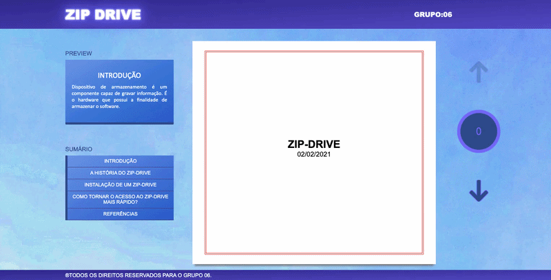

# 💾 Zip Drive

<div align="center">
  
</div>

<br>

## 📖 Sobre o Projeto
Este é um projeto acadêmico desenvolvido para a disciplina de **Arquitetura de Software**. O objetivo principal é apresentar de forma interativa e dinâmica um material completo sobre o **Zip Drive**, abordando seus conceitos fundamentais, importância no mercado de tecnologia, sua história, modelos e até mesmo o famoso problema do "Clique da Morte".

O layout foi pensado para funcionar como uma apresentação ou artigo interativo, onde o usuário pode navegar pelos tópicos através de um menu lateral e setas de navegação.

Ele também tem uma versão em apk, eu fiz para a versão mobile (Android), o mesmo que a versão PC apenas adaptada para as telas de um smartphone

## 🎥 Demonstração
<div align="center">
  
</div>

## ✨ Funcionalidades
* **Navegação Interativa:** Menu lateral com sumário ("Introdução", "A História", "Instalação", etc.).
* **Preview Dinâmico:** Um painel lateral exibe um resumo do tópico antes de o usuário acessá-lo.
* **Paginação:** Botões de seta e um contador de páginas interativo para guiar a leitura.

## 🚀 Tecnologias Utilizadas
O projeto foi construído utilizando as tecnologias web clássicas, sem o uso de frameworks complexos, garantindo leveza e carregamento rápido:
* **HTML5:** Estruturação semântica do conteúdo.
* **CSS3:** Estilização, layout e interface do usuário.
* **JavaScript:** Lógica de navegação, troca de páginas e interatividade.

## ⚙️ Como executar o projeto
Como é um projeto puramente front-end (arquivos estáticos), é muito simples de rodar localmente:

1. Clone este repositório:
   ```bash
   git clone https://github.com/Korzre/Zipdrive-project.git

2.  Abra a pasta do projeto no seu explorador de arquivos.

3.  Dê um duplo clique no arquivo index.html para abri-lo no seu navegador padrão.
(Opcional: Você pode usar a extensão "Live Server" do VS Code para rodar o projeto com recarregamento automático).